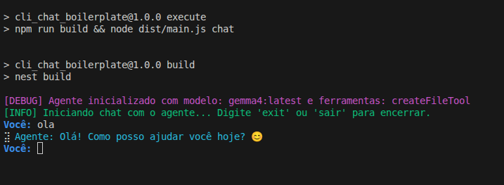

# Cli Chat Boilerplate

Boilerplate simples para construção de agentes de IA CLI utilizando Typescript, Ollama, Langchain e commander.



## Instalação

```bash
nvm use
npm install
```

## Execução

```bash
npm run execute chat
```


